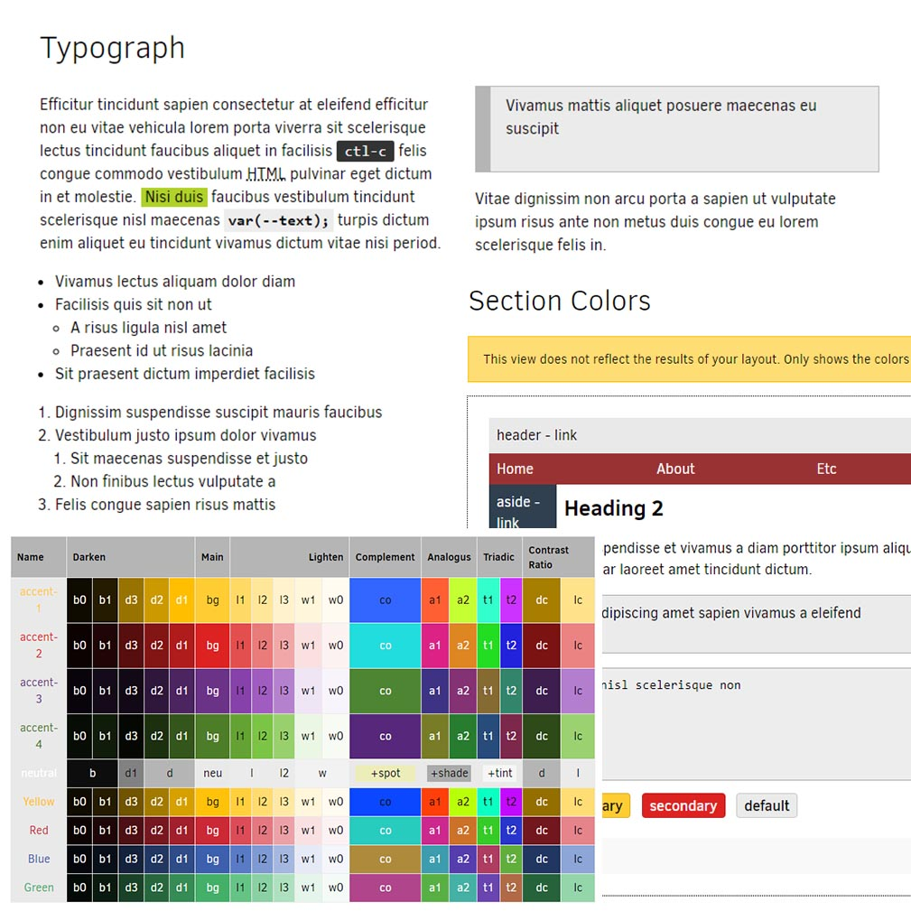

# Gasnoda

Gasnoda is a merge of Gaskeun and Noda Grav Theme.

## Requirement

 * [Grav CMS](https://getgrav.org/downloads)
 * [Gantry 5](http://gantry.org/downloads)
 * [Shortcode core Plugins](https://github.com/getgrav/grav-plugin-shortcode-core)

## Features

* Styles
  * Normalize with css variables
  * Dark Scheme Enable
  * Colours Palete*
* User/Site Template and Blueprints
* Nucleus/Gantry5 Template
* Gantry Particles
  * Branding
  * Listing
  * Carousel
  * TOC
  * Page Tree (Page Menu)
* Javascript
  * tocbot
  * w3color

## Instalation

### Manual Installation

To install this theme, just download the zip version of this repository and unzip it under "/your/site/grav/user/themes". 
Then, rename the folder to "noda". You should now have Gasnoda theme files under

`/your/site/grav/user/themes/noda`

# It limitless!

